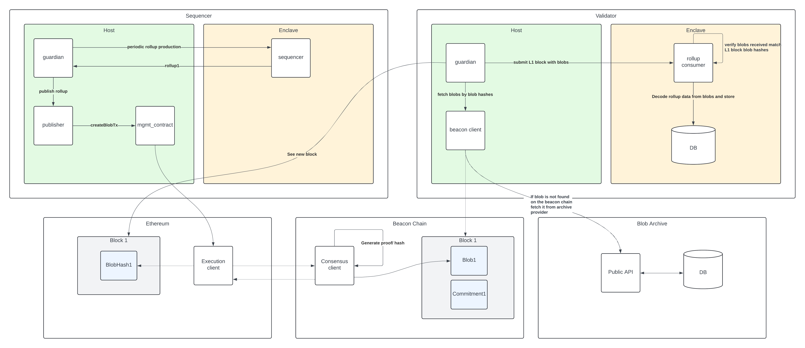

# Ten Proto-danksharding Design

## Why?

The overall aim of this is to reduce the price of publishing rollups to Ethereum and therefore the cost of transctions
to our end users. A typical ETH block can hold ~100kb data whereas blobs can carry up to 1Mb. The main benefit though is
that the blobs are stored for 30 in a sidecar so they do not compete for L1 gas. Full specification for EIP-4844 can be
found [here](https://eips.ethereum.org/EIPS/eip-4844).

## Requirements

* Publish new rollups as new blob type to Ethereum
* Node must be able to catch up when outside of the 30 day window that blobs are stored for
* Blobs must be spread across multiple rollups up if they exceed the maximum blob size enforced by Ethereum

## Modifications

* Construct `BlobTx` instead of `LegacyTx` when building rollup TX
* Additional fields required:
    * `BlobTxSidecar` - Contains the blobs, the commitments and proofs
    * `BlobHashes` - represents a list of hash outputs including the `blob_kzgs` and `blobs`
* Remove encoded rollup from calldata
* Update `PrepareTransactionToRetry` to return `BlobTx` with necessary fields. 
* New functions to calculate the `KZGCommitment` and `KZGProof` from a blob
* Update the `g.maxRollupSize` to support up to 128kb blobs
* Update to enclave creation of rollup to check for blob size when adding batches `sequencer.CreateRollup`

